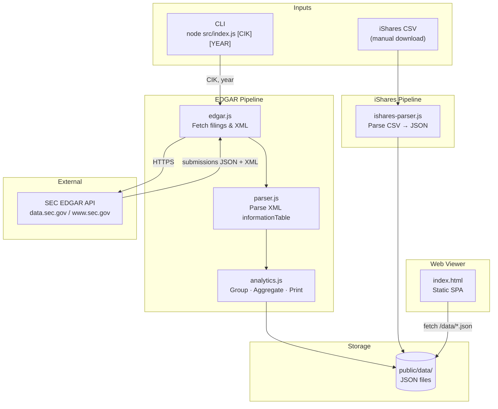
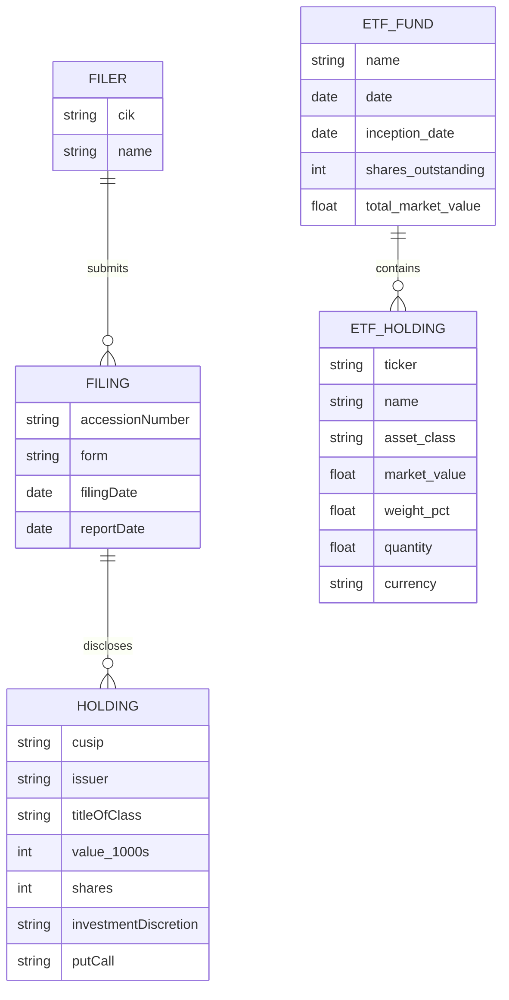

# Technical Architecture — sec-edgar Holdings Viewer

## Executive Summary

sec-edgar is a Node.js command-line tool paired with a static web dashboard for fetching, parsing, and visualizing institutional investment disclosures from the SEC EDGAR system. It targets two data sources: the SEC's public EDGAR API (for 13F quarterly filings from asset managers such as BlackRock) and iShares CSV fund exports (for Bitcoin and Ethereum ETF holdings). The key architectural choice is deliberate simplicity — no database, no server process, no framework — just two independent data-preparation pipelines that emit JSON files consumed by a single self-contained HTML viewer. This makes the tool trivially portable and operable without infrastructure.

---

## Goals & Constraints

**Functional requirements:**

- Fetch 13F-HR filings for any institutional filer identified by CIK from SEC EDGAR.
- Parse the XML `informationTable` format into structured holding records.
- Aggregate holdings by CUSIP and compute total portfolio value.
- Parse iShares fund CSV exports (IBIT, ETHA) into a normalized JSON format.
- Serve a static web UI that loads pre-generated JSON and renders sortable, filterable holding tables.

**Non-functional requirements:**

- Zero runtime dependencies beyond Node.js built-ins and `xml2js`.
- No persistent server process; the web UI is served by any static file server.
- SEC EDGAR rate limits must be respected; the tool operates on a single-fetch-per-run model.

**Hard constraints:**

- SEC EDGAR requires a `User-Agent` header identifying the requester on every API call.
- The EDGAR submissions endpoint paginates older filings into separate archive files; the tool must traverse these when targeting a specific year.
- iShares CSV files are downloaded manually; the tool does not automate that retrieval.

---

## System Overview



---

## Component Breakdown

### `src/edgar.js` — EDGAR API Client

Responsible for all communication with the SEC EDGAR public API. It exposes two functions: `getEdgarFilings` retrieves the filing metadata list for a given CIK, handling pagination into archive batches when the requested year is not present in the recent submissions. `getEdgarHoldings` resolves the filing index page for a specific accession number, discovers the XML document by scanning `href` attributes, and returns the raw XML text. All requests carry the mandatory `User-Agent` header.

### `src/parser.js` — 13F XML Parser

Translates the SEC `informationTable` XML schema into an array of plain JavaScript objects. It uses `xml2js` to deserialize the XML and normalises the root key, which can vary across filers. Each record captures issuer name, CUSIP, title of class, value in thousands, share count, investment discretion type, and put/call flag.

### `src/analytics.js` — Aggregation & Reporting

Contains pure data-transformation functions that operate on holding arrays. `groupByCusip` merges duplicate entries that share a CUSIP (or issuer name as fallback), summing value and share counts. `topHoldings` sorts and slices to the top N positions. `totalValueUSD` converts thousands-denominated values to full USD. `printSummary` formats a ranked table to stdout for quick CLI inspection.

### `src/index.js` — CLI Orchestrator

The entry point that wires the other modules together. It reads `CIK` and `YEAR` from `process.argv`, drives the full EDGAR pipeline (fetch → parse → group → write), and persists the result as a JSON file under `public/data/`. The output filename encodes both the CIK and the report period date.

### `src/ishares-parser.js` — iShares CSV Parser

A standalone parser for the iShares fund CSV export format, which has a non-standard structure: fund metadata key-value pairs appear before the column header row. The parser scans line by line to extract metadata (fund name, date, shares outstanding, asset allocation percentages) before switching into tabular mode for the holdings rows. It can also run as a direct CLI script (`node src/ishares-parser.js input.csv output.json`).

### `public/index.html` — Static Web Viewer

A self-contained single-file SPA with no build step or external dependencies. It loads one of three pre-generated JSON data files via `fetch`, then renders an interactive holdings table with client-side search, discretion filtering, column sorting, and pagination. A tab switcher separates the 13F view (BlackRock aggregate) from the iShares ETF view (IBIT or ETHA). All state is in-memory; there is no routing or persistent client state.

---

## Domain Model



**Key invariants:**

- A `HOLDING` record from the raw XML may share a CUSIP with others in the same filing; the application groups them before any output is produced.
- `value_1000s` is always denominated in thousands of USD as reported in the 13F XML; callers must multiply by 1 000 to obtain full USD.
- An `ETF_HOLDING` with `asset_class = "Alternative"` represents the primary asset (BTC or ETH); all others are cash positions.

---

## Data Architecture

**Schema (plain text):**

13F holdings output (`holdings_{CIK}_{date}.json`):
```
{
  cik: string,
  date: string (YYYY-MM-DD),
  fetched: string (ISO 8601),
  total_positions: number,
  total_value_usd: number,
  holdings: [{ issuer, cusip, class, value_1000s, shares, investDisc, putCall }]
}
```

iShares ETF output (`ibit_holdings.json`, `etha_holdings.json`):
```
{
  fund: string,
  date: string,
  inception_date: string,
  shares_outstanding: number,
  allocation: { stock, bond, cash, other },
  total_market_value: number,
  holdings_count: number,
  holdings: [{ ticker, name, sector, asset_class, market_value, weight_pct,
               notional_value, quantity, currency }],
  parsed_at: string (ISO 8601)
}
```

**Storage technology:** All data is stored as pretty-printed JSON files in `public/data/`. This is intentional — it makes the output human-readable, version-controllable, and directly servable to the browser without a backend query layer. There is no relational or document database.

**Data flow:** The EDGAR pipeline is triggered on demand via CLI and overwrites or creates a new dated file on each run. The iShares pipeline is triggered manually when a new CSV is downloaded from the iShares website. The web viewer reads whichever JSON files are present in `public/data/` at serve time; stale files remain until manually replaced.

---

## Key Architectural Decisions

| Decision | Choice | Rationale |
|---|---|---|
| Runtime | Node.js ESM (`"type": "module"`) | Native `fetch` (Node 18+) avoids an HTTP client dependency; ESM is the modern module standard |
| XML parsing | `xml2js` | The only production dependency; the SEC XML schema is straightforward and does not require a streaming parser |
| Data persistence | Flat JSON files | No infrastructure to run; output is human-readable and version-controllable alongside source code |
| Web UI | Vanilla HTML/JS, no framework | Zero build step, zero deployment; the viewer is a debugging and inspection tool, not a production application |
| Static server | `npx serve` | No custom server code; any static file server works; `serve` is only a convenience for local use |
| ETF data ingestion | Manual CSV download | iShares does not expose a public API; CSV export is the only available mechanism |
| CUSIP deduplication | Client-side (both CLI and browser) | Some filers report the same security multiple times across sub-accounts; grouping is required to avoid inflated position counts |

---

## Security & Compliance

The tool operates entirely on public data and makes no authenticated requests. The SEC EDGAR terms of service require a descriptive `User-Agent` header on every request; this is set in `edgar.js` and must be updated with real contact information before production use. The current value (`your-name your-email@example.com`) is a placeholder.

No credentials, API keys, or sensitive data are handled. The static web UI reads only from the local filesystem via the same origin and has no external network calls.

---

## Observability

The CLI emits structured progress lines to stdout for each run:

- Filing discovery: logs the matched form type, filing date, and report period.
- Parse confirmation: logs the count of raw holdings returned from the XML.
- Grouping confirmation: logs the count of unique CUSIPs after deduplication.
- Top 20 summary table: printed to stdout before file write.
- Final write confirmation: prints the output file path.

Errors from EDGAR API calls surface as thrown `Error` objects with the HTTP status and URL; the main entry point catches these and exits with code 1 after printing the message. There is no structured logging, metrics collection, or alerting.

---

## Error Handling Conventions

HTTP errors from both EDGAR endpoints are detected immediately after each `fetch` call and thrown with the status code and URL included in the message. This surfaces failures early rather than propagating a null or partial response downstream.

```js
async function fetchJSON(url, headers = {}) {
  const res = await fetch(url, { headers });
  if (!res.ok) throw new Error(`HTTP ${res.status} — ${url}`);
  return res.json();
}
```

The CLI entry point uses a top-level `.catch` to handle any unhandled rejection from the async pipeline:

```js
main().catch((err) => {
  console.error("Fatal:", err.message);
  process.exit(1);
});
```

Parsing errors (missing XML root, empty entry array) are thrown from `parser.js` with a descriptive message. There is no retry logic; transient network errors require a manual re-run.

---

## Testing Expectations

There are no automated tests in the current codebase. If tests are added, the natural units are the pure transformation functions in `analytics.js` (groupByCusip, totalValueUSD, topHoldings) and the two parsers (`parser.js`, `ishares-parser.js`), since these are deterministic and self-contained. EDGAR API calls in `edgar.js` would require either network mocking or integration tests against the live API with recorded fixtures.

---

## Appendix: Project Structure

```
sec-edgar/
├── src/
│   ├── index.js          # CLI entry point; orchestrates the EDGAR pipeline
│   ├── edgar.js          # SEC EDGAR API client (submissions + filing XML fetch)
│   ├── parser.js         # 13F informationTable XML → holding records
│   ├── analytics.js      # Pure functions: groupByCusip, topHoldings, totalValueUSD, printSummary
│   └── ishares-parser.js # iShares fund CSV → normalized JSON; also runnable as CLI
├── public/
│   ├── index.html        # Static SPA: 13F table + iShares ETF tab, no build step
│   └── data/             # Generated JSON output consumed by index.html
│       ├── holdings_0002012383_2025-12-31.json
│       ├── ibit_holdings.json
│       └── etha_holdings.json
├── IBIT_holdings.csv     # Manual iShares IBIT export (input for ishares-parser.js)
├── ETHA_holdings.csv     # Manual iShares ETHA export (input for ishares-parser.js)
└── package.json          # ESM project; only runtime dep is xml2js
```

---

*This document should be reviewed and updated on any major architectural change.*
